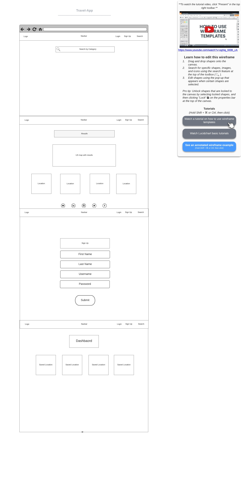

# Travel App

## Wireframe



## Application Value

```
Due to COVID19 pandemic, travel was limited for the past year. Now that the pandemic is almost over and travel bans are being uplifted, more residents will seek travel opportunities in the United States. Whenever someone travels, planning a trip out is the most time-consuming part. This Travel App was created to reduce the amount of time it takes a user to plan out a trip. 
```
## Technologies

```
Windy API
Campground Search API
Map GL
Material UI
MongoDB
```

#### Features of the Application

* Pinning location with food, hotels, and recreational activities
* Search by City or State
* Weather of the city
* Saving locations to the user dashboard
* User authentication


## Breakdown of Roles

```
Kanna - Setting up the react app, setting up repository
Stephen - Windy API
Ashley - Map API
Joe - Campground Search API
```

## Schedule of Completion
* Landing Page 
* Login Page
* Results Page(User not logged_in)
* Dashboard Page for User (user can save locations)

## Project Board

```
[Tello Board](https://trello.com/b/UuWvcmYL/travel-app) 
```

5/25: Plan, Design (wire frames) & Research
6/4: Mini Presentation; of something that relatively works/has functionality
6/11: Final Plan
6/16: Presentation Time